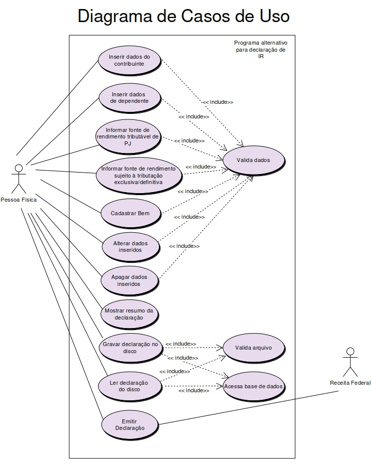
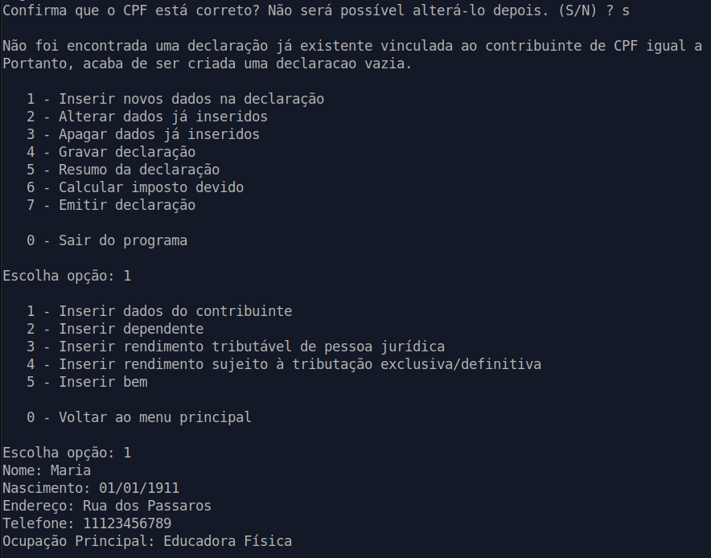
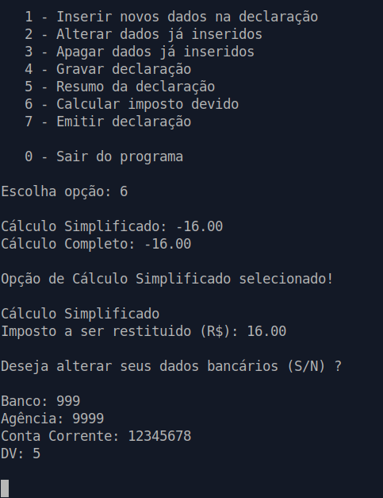

# Simulador de Declaração de Imposto de Renda

- Inicie com: `python3 programaIR.py`
- O racional do programa está na classe Declaração, em *declaracao.py*. Os outros arquivos/classes são referentes à :
  - interação com usuário
  - comunicação com base de dados SQL
  - validação, armazenamento e entrada de dados

- Os diagramas UML de Casos de Usos, Atividades e Classes estão disponíveis em *diagramas-uml.pdf*



## Screenshots

### Início




### Cálculo do Imposto




## Exemplo de Declaração Emitida

```
-----------
Declaração

-----------
Contribuinte

Nome: Maria 
Nascimento: 01/01/1911 
Endereço: Rua dos Passaros 
CPF: ########### (oculto pois a validação exige um CPF real) 
Telefone: 11123456789 
Ocupação Principal: Educadora Física

---
Dependentes

Tipo: Filha 
Dependente: Angela 
Nascimento: 15/15/1925 
CPF: 32165498

---
Rendimentos Tributáveis

CPF/CNPJ da fonte pagadora: 55544489762 
Nome da fonte pagadora: João 
Rendimento recebido de PJ: 1231.0 
Contribuição previdenciária de PJ: 123.0 
Imposto retido na fonte: 16.0 
13º salário: 123.0 
IRRF sobre 13º salário: 16.0

---
Rendimentos com Tributação Exclusiva/Definitiva

Tipo: Renda 
CPF/CNPJ da fonte pagadora: 12345678 
Nome da fonte pagadora: ABC S.A. 
Valor do rendimento: 10000.0

---
Bens

Tipo de Bem: Carro 
Descrição: Fusca 
Situaçao em 31/12/2018 (R$): 12000.0 
Situaçao em 31/12/2019 (R$): 11000.0

---
Cálculo Simplificado
Imposto a ser restituido (R$): 16.00

Dados Bancários para restituição:

Banco: 999 
Agência: 9999 
Conta Corrente: 12345678 
DV: 5

-----------
```

